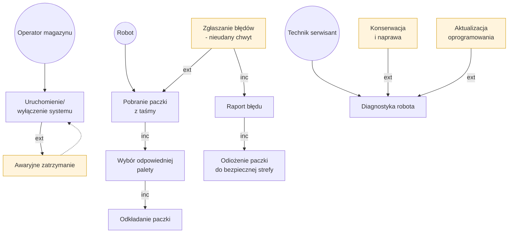
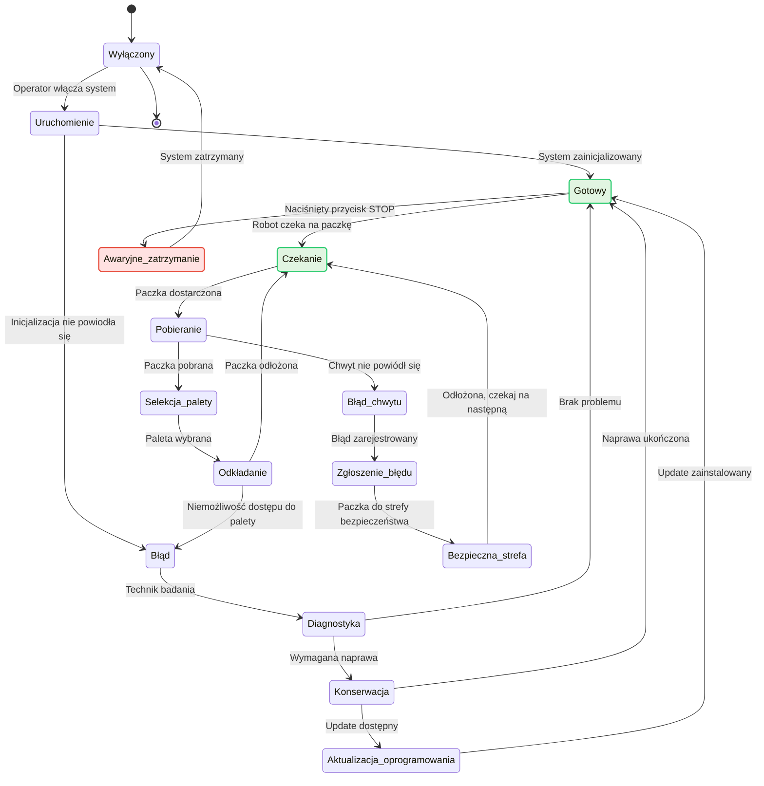
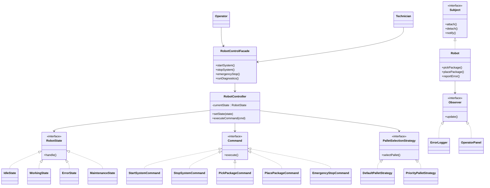

# LKLJ

# robot przemysłowy

### Schemat blokowy systemu (Flowchart)

### Diagram stanów systemu (State Diagram)

# Analiza zastosowanych wzorców projektowych

## Zastosowane wzorce projektowe

### State (Stan)
**Cel wzorca:**  
Umożliwia zmianę zachowania obiektu w zależności od jego aktualnego stanu, bez stosowania rozbudowanych instrukcji warunkowych.

**Zastosowanie w systemie:**  
Robot magazynowy może znajdować się w kilku stanach, takich jak: bezczynność, praca, błąd oraz tryb serwisowy. Każdy stan definiuje własne zachowanie robota oraz reakcję na polecenia operatora i zdarzenia awaryjne.

**Korzyści:**  
- czytelna logika sterowania,
- łatwe dodawanie nowych stanów,
- ograniczenie złożoności kodu.

---

### Command (Polecenie)
**Cel wzorca:**  
Hermetyzuje żądanie jako obiekt, co umożliwia parametryzację, kolejkowanie oraz logowanie poleceń.

**Zastosowanie w systemie:**  
Polecenia takie jak uruchomienie systemu, pobranie paczki, odkładanie paczki czy awaryjne zatrzymanie są realizowane jako osobne obiekty typu Command.

**Korzyści:**  
- rozdzielenie nadawcy polecenia od wykonawcy,
- łatwe testowanie i rozbudowa systemu,
- możliwość rejestrowania operacji.

---

### Observer (Obserwator)
**Cel wzorca:**  
Zapewnia automatyczne powiadamianie wielu obiektów o zmianach stanu innego obiektu.

**Zastosowanie w systemie:**  
Robot powiadamia zarejestrowanych obserwatorów o wystąpieniu błędów, nieudanym chwycie lub zdarzeniach awaryjnych. Obserwatorami są m.in. panel operatora oraz moduł logowania błędów.

**Korzyści:**  
- luźne powiązania pomiędzy komponentami,
- łatwe dodawanie nowych modułów monitorujących,
- dobra skalowalność.

---

### Strategy (Strategia)
**Cel wzorca:**  
Umożliwia dynamiczną zmianę algorytmu działania bez ingerencji w kod klienta.

**Zastosowanie w systemie:**  
Strategie są wykorzystywane m.in. do wyboru palety lub sposobu obsługi wyjątków, w zależności od sytuacji operacyjnej.

**Korzyści:**  
- elastyczność systemu,
- możliwość łatwej modyfikacji algorytmów,
- poprawa czytelności kodu.

---

### Facade (Fasada)
**Cel wzorca:**  
Upraszcza dostęp do złożonego systemu poprzez jeden spójny interfejs.

**Zastosowanie w systemie:**  
Operator oraz technik korzystają z jednego interfejsu sterującego, który ukrywa szczegóły implementacyjne systemu robota.

**Korzyści:**  
- prostsze i bezpieczniejsze API,
- mniejsze ryzyko błędnego użycia systemu,
- lepsza separacja odpowiedzialności.

---

## Wzorce projektowe, które nie pasują do systemu

### Builder (Budowniczy)
**Dlaczego nie pasuje:**  
Wzorzec Builder służy do tworzenia złożonych obiektów krok po kroku. W analizowanym systemie nie występuje potrzeba konstruowania obiektów o skomplikowanej strukturze — kluczowa jest logika sterowania, a nie proces budowy obiektów.

---

### Abstract Factory (Abstrakcyjna fabryka)
**Dlaczego nie pasuje:**  
Wzorzec ten jest używany do tworzenia rodzin powiązanych obiektów. System robota nie wymaga dynamicznej wymiany całych rodzin komponentów, dlatego zastosowanie tego wzorca byłoby nieuzasadnione i nadmiernie skomplikowałoby architekturę.

---

## Podsumowanie
Zastosowane wzorce projektowe wspierają modularność, elastyczność oraz bezpieczeństwo sterowania robotem magazynowym. System koncentruje się na zarządzaniu zachowaniem i reakcją na zdarzenia, dlatego wzorce konstrukcyjne nie znajdują w nim praktycznego zastosowania.
``

### Diagram klas UML

## Implementacja w C#

Kod źródłowy systemu został zaimplementowany w podejściu obiektowym z zachowaniem ścisłej separacji odpowiedzialności:
* `RobotControlFacade` – interfejs upraszczający uruchamianie procedur dla operatora i technika.
* `RobotController` – pełni rolę kontekstu (Context) zarządzającego stanem (`IRobotState`) oraz aktualną strategią logistyczną (`IPalletSelectionStrategy`).
* Szyna komend (`ICommand`) – hermetyzuje operacje pobierania, odkładania i awaryjnego zatrzymania.
* Model zdarzeniowy (`ISubject`/`IObserver`) – asynchronicznie przesyła powiadomienia o błędach z warstwy sprzętowej (`Robot`) do panelu operatorskiego (`OperatorPanel`) i systemów logowania (`ErrorLogger`).
* using System;
using System.Collections.Generic;

namespace RobotPrzemyslowy
{
    class Program
    {
        static void Main(string[] args)
        {
            Console.WriteLine("=== INICJALIZACJA SYSTEMU ROBOTA PRZEMYSLOWEGO ===\n");

            // 1. Inicjalizacja komponentów (Wzorzec Observer)
            Robot robot = new Robot();
            ErrorLogger logger = new ErrorLogger();
            OperatorPanel panel = new OperatorPanel();
            robot.Attach(logger);
            robot.Attach(panel);

            // 2. Inicjalizacja kontrolera (Wzorce State, Strategy, Command)
            RobotController controller = new RobotController(robot);

            // 3. Udostępnienie prostego interfejsu (Wzorzec Facade)
            RobotControlFacade facade = new RobotControlFacade(controller, robot);

            // --- SYMULACJA DZIALANIA SYSTEMU ---

            // Operator uruchamia system
            facade.StartSystem();

            // Proces pobierania i odkładania paczki (Normalny przepływ)
            Console.WriteLine("\n--- Proces 1: Standardowe przetwarzanie paczki ---");
            ICommand pickCmd = new PickPackageCommand(controller);
            ICommand placeCmd = new PlacePackageCommand(controller);
            
            controller.ExecuteCommand(pickCmd);
            controller.ExecuteCommand(placeCmd);

            // Zmiana strategii wyboru palety w locie (Wzorzec Strategy)
            Console.WriteLine("\n--- Zmiana strategii na priorytetową ---");
            controller.SetPalletStrategy(new PriorityPalletStrategy());
            controller.ExecuteCommand(pickCmd);
            controller.ExecuteCommand(placeCmd);

            // Symulacja błędu chwytu (Zgłoszenie błędu -> Strefa bezpieczna -> Powrót do czekania)
            Console.WriteLine("\n--- Proces 2: Symulacja błędu chwytu ---");
            robot.SimulatePickFailure(); 

            // Symulacja poważniejszej awarii i interwencji technika
            Console.WriteLine("\n--- Proces 3: Awaria krytyczna i serwis ---");
            facade.EmergencyStop();
            
            Console.WriteLine("\n--- Technik rozpoczyna diagnostykę ---");
            facade.RunDiagnostics();

            Console.WriteLine("\n=== ZAKONCZENIE SYMULACJI ===");
        }
    }

    #region 1. WZORZEC FACADE (Fasada)
    // Ukrywa złożoność podsystemów przed Operatorem i Technikiem
    public class RobotControlFacade
    {
        private readonly RobotController _controller;
        private readonly Robot _robot;

        public RobotControlFacade(RobotController controller, Robot robot)
        {
            _controller = controller;
            _robot = robot;
        }

        public void StartSystem()
        {
            Console.WriteLine("[Facade] Uruchamianie systemu...");
            _controller.ExecuteCommand(new StartSystemCommand(_controller));
        }

        public void StopSystem()
        {
            Console.WriteLine("[Facade] Zatrzymywanie systemu...");
            _controller.ExecuteCommand(new StopSystemCommand(_controller));
        }

        public void EmergencyStop()
        {
            Console.WriteLine("[Facade] ! KRYTYCZNE ZATRZYMANIE AWARYJNE !");
            _controller.ExecuteCommand(new EmergencyStopCommand(_controller));
        }

        public void RunDiagnostics()
        {
            Console.WriteLine("[Facade] Uruchamianie procedur diagnostycznych dla Technika...");
            _controller.SetState(new MaintenanceState());
            _controller.CurrentState.Handle(_controller);
        }
    }
    #endregion

    #region 2. KONTROLER (Context dla wzorców)
    public class RobotController
    {
        public IRobotState CurrentState { get; private set; }
        public IPalletSelectionStrategy PalletStrategy { get; private set; }
        public Robot RobotHardware { get; }

        public RobotController(Robot robot)
        {
            RobotHardware = robot;
            CurrentState = new IdleState(); // Stan początkowy: Wyłączony/Bezczynny
            PalletStrategy = new DefaultPalletStrategy(); // Domyślna strategia
        }

        public void SetState(IRobotState state)
        {
            Console.WriteLine($"[Context] Zmiana stanu na: {state.GetType().Name}");
            CurrentState = state;
        }

        public void SetPalletStrategy(IPalletSelectionStrategy strategy)
        {
            Console.WriteLine($"[Context] Zmiana strategii wyboru palety na: {strategy.GetType().Name}");
            PalletStrategy = strategy;
        }

        public void ExecuteCommand(ICommand command)
        {
            command.Execute();
        }
    }
    #endregion

    #region 3. WZORZEC STATE (Stan)
    public interface IRobotState
    {
        void Handle(RobotController context);
    }

    public class IdleState : IRobotState
    {
        public void Handle(RobotController context)
        {
            Console.WriteLine("[Stan: Idle] Robot jest wyłączony lub w gotowości. Czeka na aktywację.");
        }
    }

    public class WorkingState : IRobotState
    {
        public void Handle(RobotController context)
        {
            Console.WriteLine("[Stan: Working] Robot wykonuje operacje magazynowe.");
        }
    }

    public class ErrorState : IRobotState
    {
        public void Handle(RobotController context)
        {
            Console.WriteLine("[Stan: Error] SYSTEM ZABLOKOWANY. Wymagana interwencja serwisu.");
        }
    }

    public class MaintenanceState : IRobotState
    {
        public void Handle(RobotController context)
        {
            Console.WriteLine("[Stan: Maintenance] Tryb serwisowy. Technik wykonuje diagnostykę i aktualizację.");
            Console.WriteLine("[Maintenance] Aktualizacja oprogramowania zakończona sukcesem. Przywracanie do stanu Gotowy.");
            context.SetState(new WorkingState());
        }
    }
    #endregion

    #region 4. WZORZEC COMMAND (Polecenie)
    public interface ICommand
    {
        void Execute();
    }

    public class StartSystemCommand : ICommand
    {
        private readonly RobotController _context;
        public StartSystemCommand(RobotController context) => _context = context;

        public void Execute()
        {
            Console.WriteLine("[Command] Wykonuję: StartSystem");
            _context.SetState(new WorkingState());
        }
    }

    public class StopSystemCommand : ICommand
    {
        private readonly RobotController _context;
        public StopSystemCommand(RobotController context) => _context = context;

        public void Execute()
        {
            Console.WriteLine("[Command] Wykonuję: StopSystem");
            _context.SetState(new IdleState());
        }
    }

    public class PickPackageCommand : ICommand
    {
        private readonly RobotController _context;
        public PickPackageCommand(RobotController context) => _context = context;

        public void Execute()
        {
            if (_context.CurrentState is WorkingState)
            {
                Console.WriteLine("[Command] Wykonuję: PickPackage (Pobranie paczki z taśmy)");
                _context.RobotHardware.PickPackage();
            }
            else
            {
                Console.WriteLine("[Command] Nie można pobrać paczki - robot nie jest w stanie operacyjnym!");
            }
        }
    }

    public class PlacePackageCommand : ICommand
    {
        private readonly RobotController _context;
        public PlacePackageCommand(RobotController context) => _context = context;

        public void Execute()
        {
            if (_context.CurrentState is WorkingState)
            {
                Console.WriteLine("[Command] Wykonuję: PlacePackage");
                // Wykorzystanie wzorca Strategy do podjęcia decyzji przed odłożeniem
                _context.PalletStrategy.SelectPallet();
                _context.RobotHardware.PlacePackage();
            }
            else
            {
                Console.WriteLine("[Command] Nie można odłożyć paczki - błąd systemu!");
            }
        }
    }

    public class EmergencyStopCommand : ICommand
    {
        private readonly RobotController _context;
        public EmergencyStopCommand(RobotController context) => _context = context;

        public void Execute()
        {
            Console.WriteLine("[Command] ! WYKONUJĘ ZATRZYMANIE AWARYJNE !");
            _context.SetState(new ErrorState());
            _context.RobotHardware.ReportError("Naciśnięto przycisk awaryjny STOP.");
        }
    }
    #endregion

    #region 5. WZORZEC STRATEGY (Strategia)
    public interface IPalletSelectionStrategy
    {
        void SelectPallet();
    }

    public class DefaultPalletStrategy : IPalletSelectionStrategy
    {
        public void SelectPallet()
        {
            Console.WriteLine("[Strategy] Algorytm standardowy: Wybieram najbliższą wolną paletę domyślną.");
        }
    }

    public class PriorityPalletStrategy : IPalletSelectionStrategy
    {
        public void SelectPallet()
        {
            Console.WriteLine("[Strategy] Algorytm priorytetowy: Wybieram paletę ekspresową (kryterium optymalizacji czasu).");
        }
    }
    #endregion

    #region 6. WZORZEC OBSERVER (Obserwator)
    public interface IObserver
    {
        void Update(string messageType, string details);
    }

    public interface ISubject
    {
        void Attach(IObserver observer);
        void Detach(IObserver observer);
        void Notify(string messageType, string details);
    }

    // Klasa reprezentująca fizyczny hardware robota (Subject)
    public class Robot : ISubject
    {
        private readonly List<IObserver> _observers = new List<IObserver>();

        public void Attach(IObserver observer) => _observers.Add(observer);
        public void Detach(IObserver observer) => _observers.Remove(observer);

        public void Notify(string messageType, string details)
        {
            foreach (var observer in _observers)
            {
                observer.Update(messageType, details);
            }
        }

        public void PickPackage() => Console.WriteLine("[Hardware] Paczka podniesiona prawidłowo.");
        public void PlacePackage() => Console.WriteLine("[Hardware] Paczka odłożona na paletę.");

        // Obsługa scenariusza błędu chwytu z diagramu stanów
        public void SimulatePickFailure()
        {
            Console.WriteLine("[Hardware] ! Uwaga: Nieudana próba chwytu paczki !");
            Notify("BLAD_CHWYTU", "Nieudany chwyt - czujnik podciśnienia zgłasza brak szczelności.");
            
            Console.WriteLine("[Hardware] Ruch autonomiczny: Odprowadzanie uszkodzonej paczki do bezpiecznej strefy.");
            Console.WriteLine("[Hardware] Paczka zabezpieczona. Robot wraca do stanu oczekiwania.");
        }

        public void ReportError(string reason)
        {
            Notify("KRYTYCZNA_AWARIA", reason);
        }
    }

    // Konkretny Obserwator 1: Logowanie błędów
    public class ErrorLogger : IObserver
    {
        public void Update(string messageType, string details)
        {
            Console.ForegroundColor = ConsoleColor.Red;
            Console.WriteLine($"[LOG] Zarejestrowano zdarzenie [{messageType}]: {details}");
            Console.ResetColor();
        }
    }

    // Konkretny Obserwator 2: Panel operatora (HMI)
    public class OperatorPanel : IObserver
    {
        public void Update(string messageType, string details)
        {
            Console.ForegroundColor = ConsoleColor.Yellow;
            Console.WriteLine($"[HMI PANEL] ALARM DLA OPERATORA -> Typ: {messageType} | Status: Weryfikacja wymagana.");
            Console.ResetColor();
        }
    }
    #endregion
}
